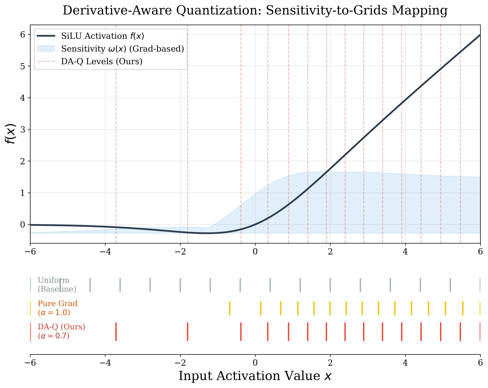

# DA-Q: Derivative-Aware Hybrid Quantization for LLM Activations

[](https://opensource.org/licenses/MIT)
[](https://www.python.org/downloads/)

This repository implements **DA-Q**, a sensitivity-aware activation quantization strategy designed for Large Language Models. By leveraging first and second-order derivatives of activation functions (e.g., SiLU), DA-Q optimizes quantization grids to minimize numerical re-construction error while maintaining hardware efficiency via **Triton-fused kernels**.

## 💡 Motivation

Standard uniform quantization treats all activation ranges equally, neglecting the local sensitivity of the model to numerical noise. Based on the Taylor expansion of the loss function, we propose a **Hybrid Sensitivity Weighting** mechanism:

$$\omega(x) = \alpha \cdot \left| \frac{df}{dx} \right| + (1-\alpha) \cdot \left| \frac{d^2f}{dx^2} \right|$$

Our findings show that $\alpha=0.7$ provides an optimal balance between capturing gradient dynamics and preserving outlier coverage.



## 🚀 Key Features

* **Sensitivity-Aware Grids:** Optimized quantization levels based on a gradient-weighted K-Means clustering.
* **High Performance:** Custom **Triton kernels** for fused Activation + Quantization, reducing memory bandwidth bottleneck.
* **Near-Lossless 4-bit:** Achieves PPL close to BF16 baseline on Qwen-2.5 and Llama-3 series.

## 🛠️ Installation

```bash
git clone https://github.com/MinkyRay/DA-Q.git
cd DA-Q
pip install -r requirements.txt
